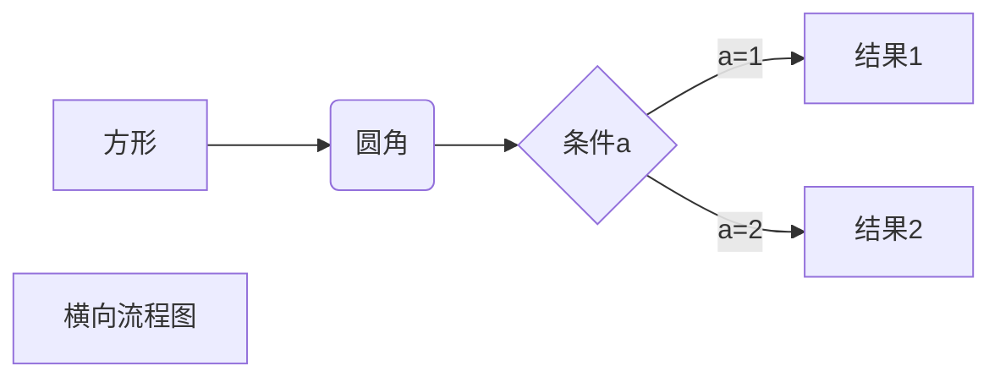
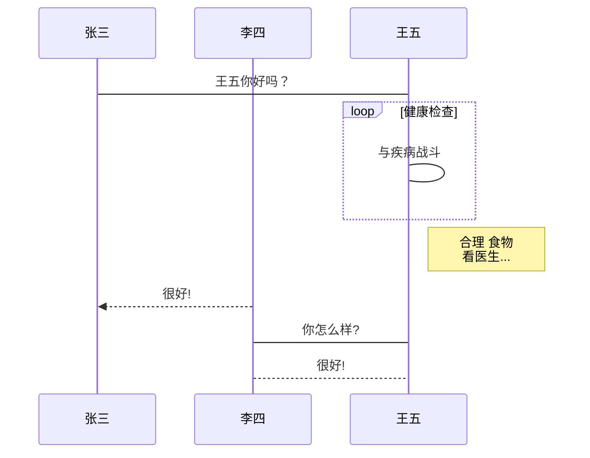
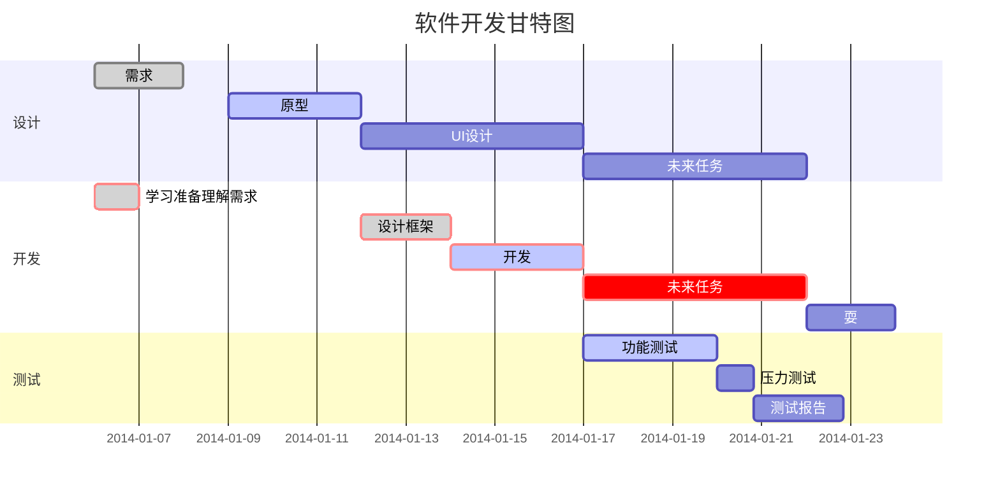

> 基于DUBBO 3.0.4版本

## 官方介绍
Apache Dubbo 是一款微服务开发框架，它提供了 RPC通信 与 微服务治理 两大关键能力。这意味着，使用 Dubbo 开发的微服务，将具备相互之间的远程发现与通信能力， 同时利用 Dubbo 提供的丰富服务治理能力，可以实现诸如服务发现、负载均衡、流量调度等服务治理诉求。同时 Dubbo 是高度可扩展的，用户几乎可以在任意功能点去定制自己的实现，以改变框架的默认行为来满足自己的业务需求。


## 发展历程
+ 开源期(2011-2013)：Dubbo是阿里巴巴B2B在2011年开源
+ 沉寂期(2013-2017)：Dubbo更新迭代很慢，维护程度低
+ 复兴期(2017-2019): 2017年8月重启维护，2018年2月加入Apache孵化器，2019年5月顺利毕业

## 核心能力
Dubbo 提供了六大核心能力：面向接口代理的高性能RPC调用，智能容错和负载均衡，服务自动注册和发现，高度可扩展能力，运行期流量调度，可视化的服务治理与运维。


## Dubbo3 新特性

1. 全新服务发现模型    
相比于 2.x 版本中的基于接口粒度的服务发现机制，3.x 引入了全新的基于应用粒度的服务发现机制

2. 下一代 RPC 通信协议    
定义了全新的 RPC 通信协议 – Triple，一句话概括 Triple：它是基于 HTTP/2 上构建的 RPC 协议，完全兼容 gRPC，并在此基础上扩展出了更丰富的语义。
   
3. 云原生    
Dubbo3 构建的业务应用可直接部署在 VM、Container、Kubernetes 等平台，Dubbo3 很好的解决了 Dubbo 服务与调度平台之间的生命周期对齐，Dubbo 服务发现地址 与容器平台绑定的问题。

4. 扩展点分离   
Dubbo3 的 maven 也发生了一些变化，org.apache.dubbo:dubbo:3.0.0 将不再是包含所有资源的 all-in-one 包，一些可选的依赖已经作为独立组件单独发布， 因此如果用户使用了不在 dubbo 核心依赖包中的独立组件，如 registry-etcd、rpc-hessian 等，需要为这些组件在 pom.xml 中单独增加依赖包。





```mermaid
A[方形] -->B(圆角)
    B --> C{条件a}
    C -->|a=1| D[结果1]
    C -->|a=2| E[结果2]
    F[横向流程图]
```


```flow
st=>start: 开始框
op=>operation: 处理框
cond=>condition: 判断框(是或否?)
sub1=>subroutine: 子流程
io=>inputoutput: 输入输出框
e=>end: 结束框
st->op->cond
cond(yes)->io->e
cond(no)->sub1(right)->op
```

```flow
st=>start: 开始框
op=>operation: 处理框
cond=>condition: 判断框(是或否?)
sub1=>subroutine: 子流程
io=>inputoutput: 输入输出框
e=>end: 结束框
st(right)->op(right)->cond
cond(yes)->io(bottom)->e
cond(no)->sub1(right)->op
```


```sequence
对象A->对象B: 对象B你好吗?（请求）
Note right of 对象B: 对象B的描述
Note left of 对象A: 对象A的描述(提示)
对象B-->对象A: 我很好(响应)
对象A->对象B: 你真的好吗？
```

```sequence
Title: 标题：复杂使用
对象A->对象B: 对象B你好吗?（请求）
Note right of 对象B: 对象B的描述
Note left of 对象A: 对象A的描述(提示)
对象B-->对象A: 我很好(响应)
对象B->小三: 你好吗
小三-->>对象A: 对象B找我了
对象A->对象B: 你真的好吗？
Note over 小三,对象B: 我们是朋友
participant C
Note right of C: 没人陪我玩
```




